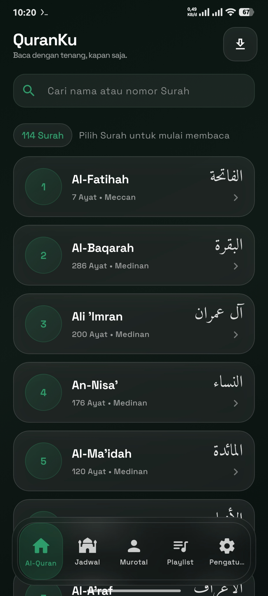
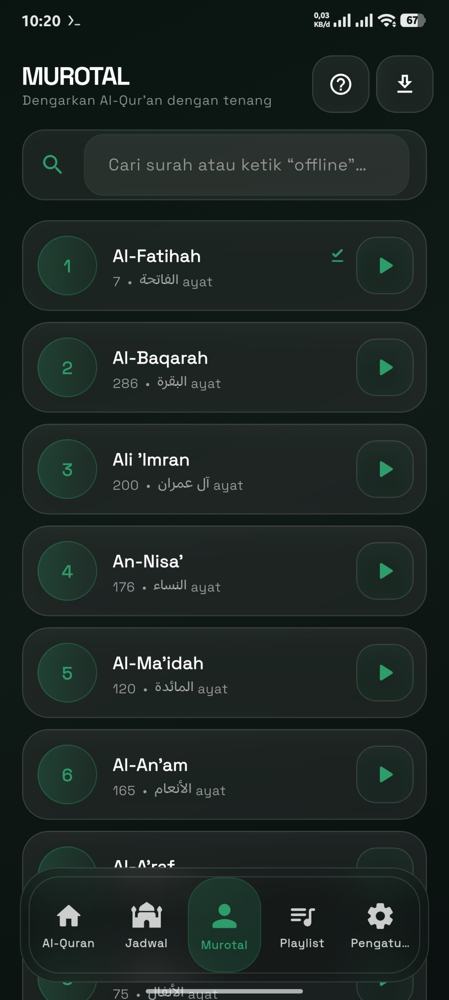
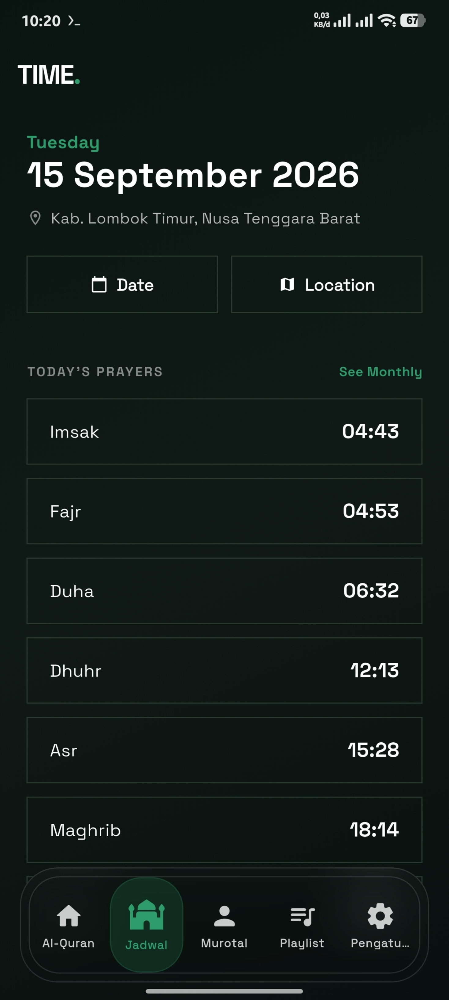
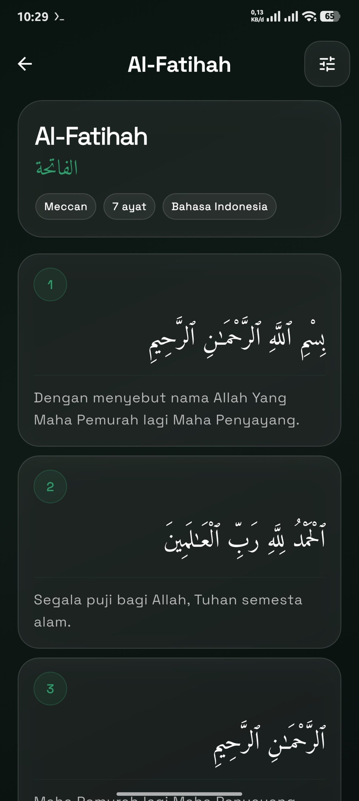
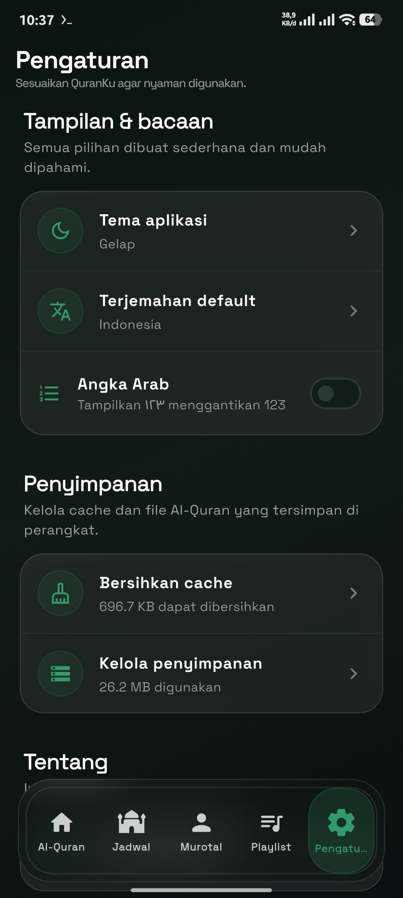
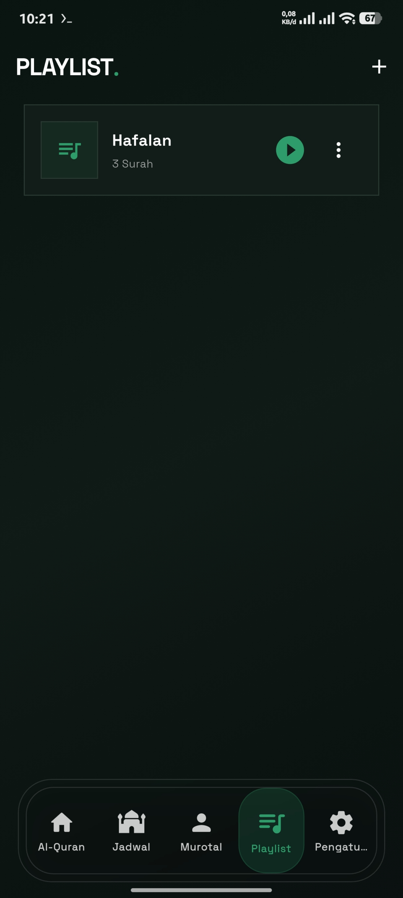

# QuranKu

A minimalist and modern Quran application built with Flutter for Android and iOS. QuranKu is designed around a calm reading experience, clear typography, Liquid Glass-inspired UI, and a simple audio experience that remains comfortable to use for all ages.

> **QuranKu by RAFDEV** — simple, calm, and focused on reading and listening to the Qur’an.


## Preview

> **Tambahkan screenshot kamu sendiri di folder `docs/screenshots/` dengan nama file seperti di bawah.**
> Jika file belum ada, gambar hanya akan menjadi placeholder sampai kamu mengunggahnya.

### Beranda



### Murotal



### Time



### Detail Surah



### Pengaturan



### Playlist



## ✨ Features

### 📖 Quran Reading

- 114 Surahs with Arabic text and Indonesian translation.
- Search Surahs by name or number.
- Jump directly to a specific Ayah.
- Clear, readable Arabic typography using Amiri.
- Offline caching for downloaded Quran content.
- Light and dark themes.

### 🎧 Murotal

- Quran recitation playback with continuous Ayah progression.
- Previous/next Surah controls.
- Repeat and playback-order controls.
- Persistent mini player while navigating the app.
- Full-screen player with playback controls and progress seeking.
- Murotal download support for offline listening.

### 🌧️ Background Sound

- Optional ambient rain-like background sound.
- Separate volume controls for Quran audio and background sound.
- Background sound follows Quran playback state.
- Settings are persisted between sessions.

### 🎵 Playlist

- Create multiple playlists.
- Add and remove Surahs from playlists.
- Reorder playlist items.
- Rename and delete playlists.
- Persistent playlists using local storage.

### 🕌 Prayer & Daily Tools

- Daily prayer-time display.
- Ramadan imsakiyah support.
- Simple navigation designed to keep frequently used features easy to reach.

### 🎨 Interface

- Minimalist Liquid Glass-inspired design.
- Large touch targets and readable typography for users of all ages.
- Green RAFDEV accent with restrained translucency and blur.
- Floating mini player and glass navigation system.
- Responsive layouts for different screen sizes.

## 🛠️ Tech Stack

| Category | Technology |
| --- | --- |
| Framework | Flutter / Dart |
| Audio | just_audio |
| Networking | http, dio |
| Local Storage | shared_preferences, path_provider |
| Typography | google_fonts |
| Notifications | flutter_local_notifications |
| Permissions | permission_handler |
| Navigation / Lists | scrollable_positioned_list |
| Utilities | intl, url_launcher |
| UI | Material 3 + custom Liquid Glass widgets |

## 📁 Project Structure

```text
lib/
  main.dart
  models/
  screens/
    splash_screen.dart
    main_screen.dart
    surah_list_screen.dart
    surah_detail_screen.dart
    murotal_screen.dart
    murotal_download_screen.dart
    playlist_screen.dart
    prayer_times_screen.dart
    imsakiyah_screen.dart
    settings_screen.dart
    storage_management_screen.dart
    about_screen.dart
  services/
    api_service.dart
    audio_service.dart
    background_audio_service.dart
    download_service.dart
    murotal_download_service.dart
    playlist_service.dart
    settings_service.dart
  widgets/
    liquid_glass.dart
    mini_player.dart
    full_player_view.dart
```

## 🚀 Getting Started

### Requirements

- Flutter 3.47.4 or compatible stable Flutter SDK.
- Java JDK 17 or later for Android builds.
- Android Studio or Visual Studio Code.
- Xcode on macOS for iOS builds.

### Installation

Clone the QuranKu repository, open the project directory, install the Flutter dependencies, then run the application.

```bash
flutter pub get
flutter run
```

## 📦 Build

### Android

```bash
flutter build apk --release
```

For a Play Store package:

```bash
flutter build appbundle --release
```

### iOS

```bash
flutter build ios --release
```

## 🔐 Release APK

The current public release is:

**`v3.0.94`**

## ❤️ Support

Support QuranKu / RAFDEV through the project’s official donation channel.

**Saweria:** `saweria.co/rafdev`

## 👨‍💻 Developer

**RAFDEV**

- GitHub username: `Rafigibran`
- Project: `QuranKu`
- Donation: `saweria.co/rafdev`

## 📜 License

This project is licensed under the MIT License. See the repository `LICENSE` file for details.

---

**QuranKu** • Built with Flutter by **RAFDEV**
